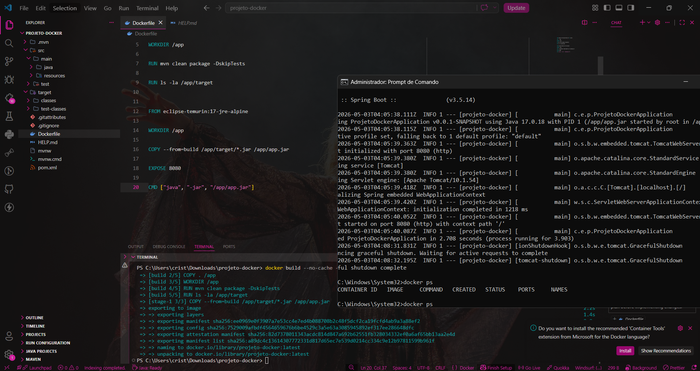
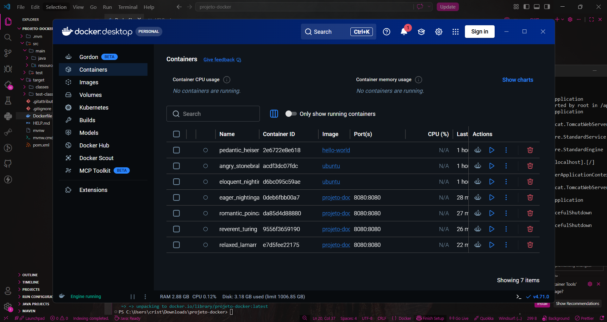
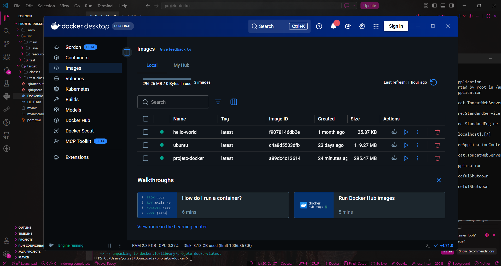

# 🐳 Projeto Docker Dev

Este repositório contém o projeto desenvolvido durante o meu curso de **Fundamentos de Docker | Conteinerizando sua aplicação** na plataforma Kipper Dev.

---

## 📌 Sobre o Projeto

Este projeto foi criado como parte da minha jornada de aprendizado com Docker, com foco em entender como conteinerizar aplicações backend e aplicar conceitos fundamentais de execução em ambientes isolados.

Durante o desenvolvimento, explorei práticas importantes para garantir mais organização, portabilidade e consistência no deploy da aplicação.

---

## 🧠 O que aprendi

* 📦 Conceitos de conteinerização
* 🐳 Criação e gerenciamento de imagens Docker
* 📝 Estruturação com Dockerfile
* ⚙️ Build e execução de containers
* 🌐 Exposição de portas
* 🚀 Multi-stage build
* 🧼 Organização e otimização de ambiente

---

## 🛠️ Tecnologias utilizadas

* Java 17
* Spring Boot
* Maven
* Docker

---

## 📸 Preview





---

## ▶️ Como rodar o projeto

```bash
# Clone este repositório
git clone https://github.com/CamilleGFAlmeida/projeto-docker

# Acesse a pasta do projeto
cd projeto-docker

# Faça o build da imagem
docker build -t projeto-docker .

# Execute o container
docker run -p 8080:8080 projeto-docker
```

Depois, abra no navegador:

```bash
http://localhost:8080
```

---

## 📜 Certificado

Você pode validar a conclusão do curso aqui:

🔗 https://fernandakipper.com/certificado/0ad6a70a-f240-4dd2-ba05-aade26e1f718

---

## 💡 Melhorias futuras

* Criar ambiente com Docker Compose
* Adicionar variáveis de ambiente
* Explorar integração com banco de dados
* Estudar orquestração com Kubernetes

---

## 👩‍💻 Autora

Feito com 💜 por **Camille Guillen Fernandes de Almeida**

---

## ⭐ Sinta-se à vontade para

* Dar uma estrela no repositório
* Fazer um fork
* Se conectar comigo no LinkedIn

---

> "Cada novo container criado representa mais um passo na construção de aplicações modernas e escaláveis." 🚀
